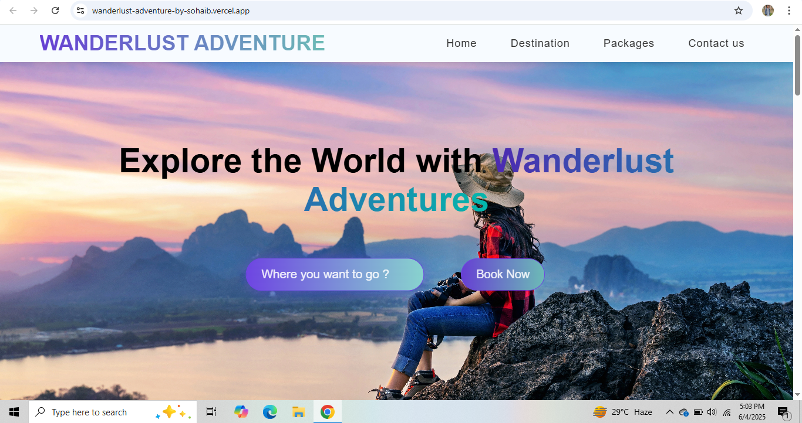

# 🌍 Wanderlust Adventure

**A sleek and modern travel landing page** showcasing clean UI, smooth animations, and responsive design — perfect for inspiring wanderlust! Built with ✨ HTML, CSS, JavaScript, GSAP, and Swiper.js.

## 🚀 Live Preview
👉 [Visit the Live Site](https://wanderlust-adventure-by-sohaib.vercel.app/)

---

## 📸 Project Screenshot

<!-- Replace the path with your screenshot image -->


---

## 🛠️ Tech Stack & Tools

| Tech             | Usage                                   |
|------------------|------------------------------------------|
| 🧱 **HTML5**       | Structure and semantic layout             |
| 🎨 **CSS3**        | Styling and responsive design             |
| 🧠 **JavaScript**  | Interactive features                     |
| 🌊 **Swiper.js**   | Responsive sliders/carousels              |
| 🎬 **GSAP**        | Smooth animations and scroll effects      |
| 🌐 **Vercel**      | Live deployment and hosting               |

---

## ✨ Features

- 📱 **Fully Responsive** design (mobile-first)
- 🎞️ **Smooth scroll animations** using GSAP
- 🖼️ **Swiper.js image slider** for featured destinations
- 🧊 **Modern glassmorphism** UI style
- 🧭 Clean sections: Hero, About, Destinations, Testimonials, Footer
- ☁️ Deployed on **Vercel** with blazing-fast load speed

---

## 📁 Folder Structure
```
wanderlust-adventure/ 
├── index.html
├── style.css
├── script.js
└── assets/
├── images/
└── fonts/
```

---

## 💡 What I Learned

- Crafting pixel-perfect layouts with modern design trends
- Integrating **animation libraries** like GSAP for UX polish
- Creating **sliders** and interactive components using Swiper.js
- Managing responsive layout without any CSS framework
- Deploying projects on Vercel for instant live preview

---

## 📌 Project Status

✅ Completed – open to improvements and additional features like:
- 🌗 Dark mode
- 🌍 Multi-page expansion
- 📝 CMS integration for dynamic content

---

## 🙋‍♂️ About Me

I'm **Sohaib Khan**, a passionate 👨‍💻 MERN Stack Developer and UI/UX enthusiast currently on a **URL shortner with Custom slug**.  
I love building clean, fast, and user-friendly websites that create impact.  
📌 [LinkedIn](https://linkedin.com/in/sohaib-khan-308407325)

---

## ⭐ Feedback or Suggestions?

If you have any ideas or suggestions, feel free to [open an issue](https://github.com/Sohaibkundi2/wanderlust-adventure/issues) or connect with me!

---

## 🖇️ Useful Links

- 🔗 [Live Site on Vercel](https://wanderlust-adventure-by-sohaib.vercel.app/)
- 📂 [View Repository on GitHub](https://github.com/Sohaibkundi2/wanderlust-adventure)

---

### 🧠 Let's Build More!
> *"Code is like a journey — the more you explore, the more you learn!"*


